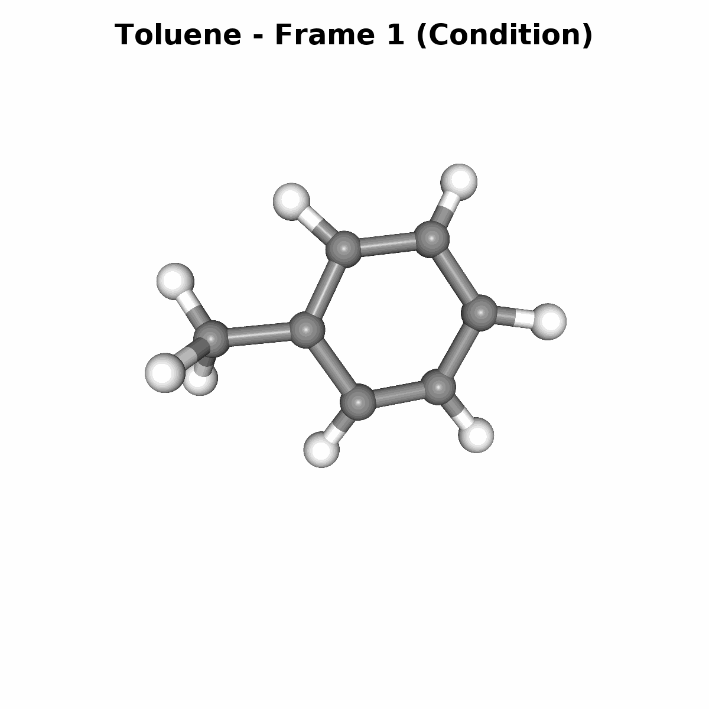

<head>
  <link rel="stylesheet" href="https://cdnjs.cloudflare.com/ajax/libs/font-awesome/6.5.1/css/all.min.css">
</head>

  

# Introduction
Understanding the dynamics of spatial systems is a fundamental challenge 
in many scientific and engineering domains. In this paper, we focus on spatial dynamical systems, where *scenes* are composed of distinguishable entities at defined spatial locations. 
Modeling temporal trajectories of such entities quickly becomes challenging, especially when:

  * stochasticity is involved, and
  * when entities should be *traceable*.
    
A prime example is molecular dynamics, where trajectories of individual atoms 
are modeled via Langevin dynamics, which accounts for omitted degrees of freedom 
by using of stochastic differential equations. Consequently, the trajectories of the atoms themselves 
become non-deterministic, but the atoms remain traceable over time. 

# Dynamical Systems
A dynamical systems can be described by the following differential equation:

$$
\begin{equation}
\frac{d}{dt}\mathbf{s} = f(\mathbf{s},t,\mathbf{u};\beta) + \mathbf{d}
\end{equation}
$$

Here, $$\mathbf{s}$$ represents the state of the system - imagine, for instance, the current weather conditions including temperature and humidity. The variable $$t$$ denotes the time point at which we observe the state, while $$\mathbf{u}$$ represents a control parameter. This control could be something like a hail prevention airplane spraying silver iodide into clouds, or in a simpler example, applying force to a cart supporting a pendulum. The parameter $$\beta$$ characterizes the system's inherent properties, such as a pendulum's length or mass. The system can be also influenced by random disturbances $$\mathbf{d}$$.

At its core, $$f$$ is a vector-valued function that describes how the system state changes given its current state $$\mathbf{s}$$. Which can be seen as a vector field, where at each point in the state space, $$f$$ indicates the direction and magnitude of change.

An important practical consideration is that we rarely have access to the complete state $$\mathbf{s}$$. Instead, we typically only have access to measurement $$\mathbf{y}=\mathbf{g}(\mathbf{s},t) + \mathbf{n}$$. Consider the human brain as an example: while it contains billions of neurons, we can only measure the activity of a small fraction of them at any given time. Furthermore, the system might be influenced by latent variables - hidden factors that we cannot measure and measurements can also include noise $$\mathbf{n}$$

For many dynamical systems of interest we often do not directly have access to the function $$f$$, only to measurements $$\mathbf{y}$$ which makes it very attractive to apply **Machine Learning** methods.

# Method

## Problem definition and predictive aim
Lets assume we have a sequence of measurement $$\mathbf{y}^{[1:T]}=\mathbf{y}^1,\dots,\mathbf{y}^T$$ for a dynamical system of interest. We consider spatial state spaces with $$N$$ entities, where each state $$\mathbf{y}^t$$ consists of the positions $$\mathbf{X}^t\in\mathbb{R}^{N\times D_x}$$ and features $$\mathbf{M}^t\in \mathbb{R}^{N\times D_m}$$ for an entity at time $$t$$. 

For example, in a basketball game scenario:

* $$\mathbf{X}^t$$ captures the player's positions on the court
* $$\mathbf{M}^t$$ encodes player attributes such as team affiliation and time spent in play

or for a a molecule:
* $$\mathbf{X}^t$$ captures the atoms's postions
* $$\mathbf{M}^t$$ encodes the atom type, where $$\mathbf{M}^t=\mathbf{M}$$

 

We can partition the state sequence $$\mathbf{y}^{[1:T]}=\mathbf{y}^{1},\dots, \mathbf{y}^{T_o},\dots,\mathbf{y}^{T}$$ into:

* An observation sequence $$\mathbf{y}^{[1:T_o]}=\mathbf{y}^1,\dots,\mathbf{y}^{T_o}$$ of length $$T_o$$.
* A future sequence $$\mathbf{y}^{[T_o+1:T]}=\mathbf{y}^{T_o+1},\dots,\mathbf{y}^{T}$$ of length $$T-T_o$$.

Given the observed states $$\mathbf{y}^{[1:T_o]}$$, our goal is to predict the future states $$\mathbf{y}^{[T_o+1:T]}$$ 

## LaM-SLidE

  

    <h3>Entity identifiers</h3>
    One of our key contribution are <b>Entity Identifiers</b>.
    Each entity in our system gets a unique ID - think of it like name tags for atoms. In the image on the right you can see an Aspirin molecule, were we assing IDs to the individual atoms. For better illustration we only labeld four atoms, but imagine that every atom gets an ID.
  

  

    
  

 

  

# Experiments

## Basketball (NBA)

  

    

      <i class="fa-solid fa-clock" style="margin-right: 8px;"></i>
      Conditioning states: 8
    

    

      <i class="fa-regular fa-clock" style="margin-right: 8px;"></i>
      Future states: 12
    

        

      <i class="fa-solid fa-globe" style="margin-right: 8px;"></i>
      Total states: 12
    

  

### Sampled Trajectories 
#### Rebound

  
 

  

  

  

#### Scoring

  

  

  

  

## Organic Molecules (MD17)

  

    

      <i class="fa-solid fa-clock" style="margin-right: 8px;"></i>
      Conditioning states: 10
    

    

      <i class="fa-regular fa-clock" style="margin-right: 8px;"></i>
      Future states: 20
    

        

      <i class="fa-solid fa-globe" style="margin-right: 8px;"></i>
      Total states: 30
    

  

### Sampled Trajectories 

  
  
  

  
  
  

## Tetrapeptides

  

    

      <i class="fa-solid fa-clock" style="margin-right: 8px;"></i>
      Conditioning states: 1
    

    

      <i class="fa-regular fa-clock" style="margin-right: 8px;"></i>
      Future states: 9 999
    

        

      <i class="fa-solid fa-globe" style="margin-right: 8px;"></i>
      Total states: 10 000
    

      

      <i class="fa-solid fa-rotate-right" style="margin-right: 8px;"></i>
      Number of rollouts: 10
    

  

### Sampled Trajectories 

  
  
  

### TICA and Backbone Angles

  
  

 

# Further reads

Another approach of modeling dynamical systems in latent space was introduced in [UPT: Universal Physics Transformers](https://arxiv.org/abs/2402.12365) in the field of fluid dynamics (Navier-Stokes equations). Unlike our approach, UPT models systems with billions of particles that become untrackable individually. However, for these systems, tracking individual particles is often unnecessary - instead, the underlying field is modeled, as the primarily interst lies in the overall behavior of the system and not the individual particles. E.g. in weather forcasting we are not interested where each individual atom is placed in the atmosphere but want to predicte the overall weather.